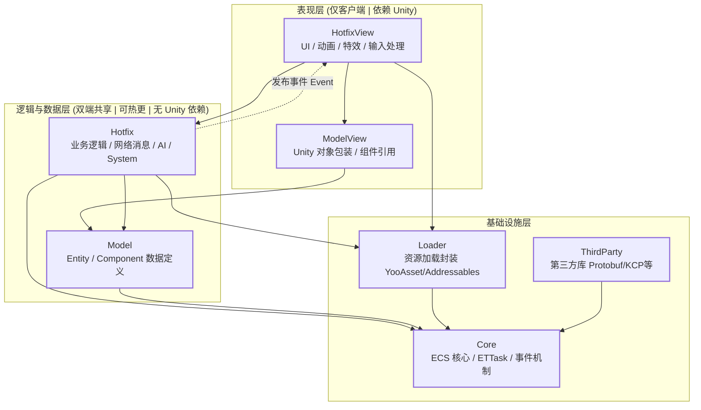
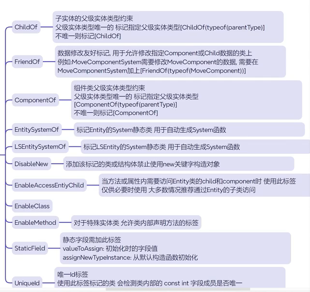
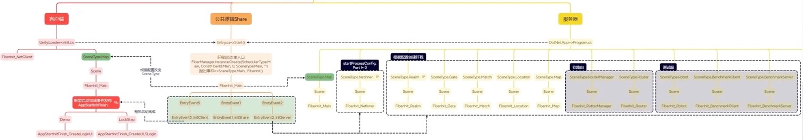
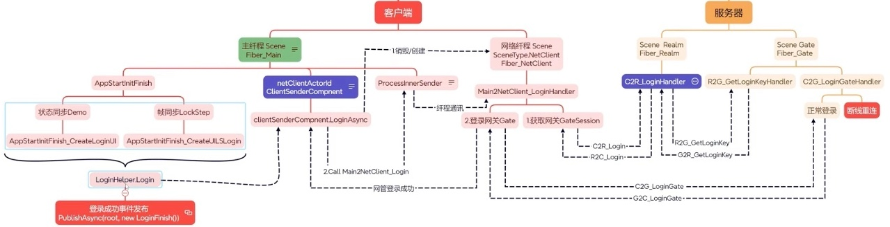
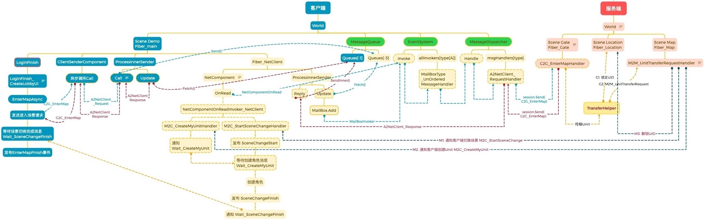
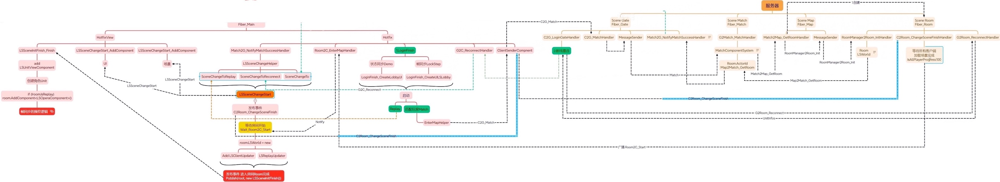

# ET代码阅读记录
## 模块划分
在 ET 框架（特别是基于 Unity 的客户端版本）中，这种模块划分是为了实现代码热更新、逻辑与表现分离以及服务端/客户端代码共享。以下是各个子模块的具体作用及设计逻辑：

1. 核心基础层
*   Core (cn.etetet.core)
    *   作用：框架的最底层核心，包含 ECS 架构的基础实体（Entity）、组件（Component）、系统（System a.k.a SystemHelper/SystemBase）定义，以及核心的异步任务调度（ETTask）、对象池、事件机制等。
    *   特点：不依赖 Unity 引擎 API，纯 C实现。这是整个框架运行的基石，无论是服务端还是客户端都必须引用。
*   ThirdParty
    *   作用：存放第三方库和插件。
    *   内容：通常包括网络库（如 KCP/ENet）、序列化库（Protobuf/MongoDB Driver）、数学库或其他非 Unity 原生的 C库。
    *   目的：将外部依赖隔离，方便统一管理和升级，避免污染业务代码。

2. 数据与逻辑层（支持热更与服务端复用）
这一层的代码严禁引用任何 Unity 引擎相关的 API（如 `UnityEngine`, `UnityEditor`），以便能在服务端（.NET Core/.NET 6+）和客户端之间共享，并支持 DLL 热更新。

*   Model (cn.etetet.model)
    *   作用：定义游戏世界的数据结构。
    *   内容：包含 Entity 的子类定义、Component 的数据字段定义。例如：玩家属性、背包物品数据、地图配置数据等。
    *   特点：只存数据，不包含复杂的游戏逻辑行为。它是“状态”的载体。
*   Hotfix (cn.etetet.hotfix)
    *   作用：实现游戏的核心逻辑行为。
    *   内容：包含各种 System 类（继承自 AwakeSystem, UpdateSystem, DestroySystem 等），用于处理 Model 中数据的初始化、更新和销毁逻辑；以及网络消息的处理逻辑、战斗计算、AI 逻辑等。
    *   特点：
        *   可热更：这部分代码编译为 DLL，运行时可替换，用于修复 Bug 或更新玩法。
        *   双端共享：由于不依赖 Unity，同样的 Hotfix 代码可以在服务端运行，实现“逻辑一致性”，减少前后端沟通成本。

3. 表现层（仅客户端，依赖 Unity）
这一层的代码可以且必须引用 Unity 引擎 API，负责将逻辑层的数据可视化。这部分代码通常不支持传统意义上的 DLL 热更（因为涉及资源绑定和 Unity 内部机制），或者通过 Addressables/YooAsset 等资源系统进行间接更新。

*   ModelView (cn.etetet.modelview)
    *   作用：定义与 Unity 表现相关的数据结构或组件包装。
    *   内容：例如，一个 `Unit` 在 Model 层只是坐标和血量数据，而在 ModelView 层可能包含对 Unity `GameObject`、`Animator`、`ParticleSystem` 等组件的引用或包装器。
    *   特点：桥接纯数据与 Unity 对象。
*   HotfixView (cn.etetet.hotfixview)
    *   作用：实现表现层逻辑，即“如何显示”。
    *   内容：
        *   UI 界面的打开/关闭、数据绑定。
        *   模型的加载、动画播放、特效生成。
        *   摄像机控制、输入反馈（点击特效等）。
    *   交互原则：
        *   表现层 -> 逻辑层：直接调用。例如 UI 按钮点击后，调用 `LoginSystem.Login()`。
        *   逻辑层 -> 表现层：禁止直接调用。逻辑层通过发布事件（EventSystem.Publish）通知表现层。例如，登录成功后，逻辑层发布 `LoginSuccessEvent`，HotfixView 中的监听者收到事件后，执行关闭登录面板、打开主界面的操作。
    *   目的：确保逻辑层完全解耦，使得同一套逻辑可以适配不同的表现层（如 PC 端、移动端、甚至无界面的压测机器人）。

4. 资源管理层
*   Loader (cn.etetet.loader / cn.etetet.yooassets)
    *   作用：封装资源加载逻辑。
    *   内容：通常基于 YooAsset 或 Unity 原有的 Addressables 进行二次封装。提供统一的异步加载接口（`LoadAssetAsync`），处理资源的引用计数、依赖加载、场景切换和资源卸载。
    *   特点：屏蔽底层资源管理细节，让业务层（Hotfix/HotfixView）只需关心“我要什么资源”，而不必关心“资源在哪里、怎么加载、何时卸载”。

总结架构图示
以下是 ET 框架模块架构 Mermaid 流程图。该图清晰展示了各模块的依赖关系及数据流向，特别是逻辑层与表现层通过事件解耦的核心设计。



图表说明：
1.  分层结构：
    *   表现层 (蓝色)：`HotfixView` 和 `ModelView` 直接依赖 Unity 引擎，负责视觉呈现和用户交互。
    *   逻辑层 (橙色)：`Hotfix` 和 `Model` 纯 C实现，不依赖 Unity，支持热更新和服务端复用。
    *   基础设施层 (紫色)：`Core`、`Loader` 和 `ThirdParty` 为上层提供底层支持。

2.  依赖方向：
    *   上层模块依赖下层模块（如 `HotfixView` 依赖 `Hotfix`）。
    *   逻辑层 (`Hotfix`) 严禁依赖表现层 (`HotfixView`)，确保逻辑纯净。

3.  通信机制：
    *   单向调用：表现层可以直接调用逻辑层接口（如点击按钮触发登录逻辑）。
    *   事件解耦：逻辑层通过发布事件（虚线）通知表现层更新 UI（如登录成功后弹出主界面），避免循环依赖。


关键设计哲学：
1.  解耦：逻辑（Hotfix）不知道表现（HotfixView）的存在，只通过数据（Model）和事件交互。
2.  热更：只有不依赖 Unity 的代码（Model/Hotfix）才能方便地进行 DLL 热更新。
3.  复用：服务端可以直接复用 Model 和 Hotfix 代码，保证逻辑绝对一致。
## 视频教程
[ET框架 -- 组件定义与生命周期](https://www.bilibili.com/video/BV1Sn4y1Q7Ne?t=1939.5)  by [和v诺](https://space.bilibili.com/394245976/lists/2952969?type=season)


## ET中的代码生成
### Proto2CS

ET框架中的[Proto2CS](../Share/Tool/Proto2CS/Proto2CS.cs)工具是ET框架‌自己实现‌的，而不是调用开源的proto2cs工具。

从ET框架的架构设计和实现方式来看，Proto2CS是框架内部的一个专用代码生成工具，用于将.proto协议文件转换为C#代码。这个工具是ET框架开发团队根据自身需求和框架特点专门开发的，以确保与ET框架的其他组件（如MemoryPack序列化机制、网络通信模块等）能够无缝集成。

该工具的实现方式通常包括：

解析.proto文件语法
生成对应的C#类定义
生成Opcode映射表
与ET框架的序列化系统集成

这种自研方式使得工具能够更好地适配ET框架的具体需求，包括其特定的协议处理逻辑和性能优化要求。

| 源文件                                                                          | 生成文件|
|------------------------------------------------------------------------------|-----------------------------------------------------------------------------------------------------|
| [ClientMessage_C_1000.proto](../Unity/Assets/Config/Proto/ClientMessage_C_1000.proto) |[ClientMessage_C_1000.cs](../Unity/Assets/Scripts/Model/Generate/ClientServer/Message/ClientMessage_C_1000.cs)|
| [OuterMessage_C_10001.proto](../Unity/Assets/Config/Proto/OuterMessage_C_10001.proto) |[OuterMessage_C_10001.cs](../Unity/Assets/Scripts/Model/Generate/ClientServer/Message/OuterMessage_C_10001.cs)|

### EntitySystem等自动生成
#### 示例及过程
```csharp
[ComponentOf(typeof (Unit))]
    public class BuffComponent: Entity, IAwake, IUpdate
    {
       
    }

    [EntitySystemOf(typeof(BuffComponent))]
    [FriendOf(typeof(BuffComponent))]
    public static partial class BuffComponentSystem
    {
        [EntitySystem]
        private static void Awake(this ET.BuffComponent self)
        {

        }
        [EntitySystem]
        private static void Update(this ET.BuffComponent self)
        {

        }
    }

  // 自动生成代码如下：
    public static partial class BuffComponentSystem
    {
        [EntitySystem]
        public class ET_BuffComponent_AwakeSystem: AwakeSystem<ET.BuffComponent>
        {   
            protected override void Awake(ET.BuffComponent self)
            {
                self.Awake();
            }
        }
    }

    public static partial class BuffComponentSystem
    {
        [EntitySystem]
        public class ET_BuffComponent_UpdateSystem: UpdateSystem<ET.BuffComponent>
        {   
            protected override void Update(ET.BuffComponent self)
            {
                self.Update();
            }
        }
    }
```


ET 框架实现上述代码自动生成及注册调用的核心机制主要依赖于 CSource Generator（源代码生成器） 技术，结合 ET 特有的 EntitySystemOf 特性与 EventSystem 事件驱动架构。

以下是具体的实现原理与流程解析：

1. 代码自动生成原理：Source Generator

在 ET 8.0 及更高版本中，框架引入了 `cn.etetet.sourcegenerator`包，利用 Roslyn 编译器提供的 Source Generator API 在编译期进行代码分析生成。

*   触发机制：
    开发者在静态部分类（`static partial class`）上标记 `[EntitySystemOf(typeof(BuffComponent))]` 特性。Source Generator 会在编译阶段扫描所有带有此特性的类。
*   解析过程：
    生成器会查找该静态类中带有 `[EntitySystem]` 标记且方法签名为 `private static void MethodName(this ComponentType self)` 的方法。例如 `Awake` 和 `Update`。
*   代码注入：
    根据解析到的方法名（如 Awake, Update），生成器会自动创建继承自对应系统基类（如 `AwakeSystem<T>`, `UpdateSystem<T>`）的内部类。
    *   生成的类名通常遵循 `ET_{ComponentName}_{MethodName}System` 的命名规范。
    *   生成的类会重写基类的虚方法（如 `protected override void Awake(T self)`），并在其中调用开发者编写的静态扩展方法（如 `self.Awake()`）。

这就解释了为什么你只需要写简单的静态扩展方法，而最终编译后的 DLL 中会出现完整的 `AwakeSystem` 和 `UpdateSystem` 子类。

2. 系统注册机制：EventSystem

生成的 System 类并不是通过硬编码注册到某个列表中的，而是利用 ET 的 EventSystem（事件系统） 进行自动发现和注册。

*   特性标记：
    注意生成的代码中保留了 `[EntitySystem]` 特性（或者在旧版本/特定配置下可能依赖类名规范或继承关系，但在 ET 8+ 中通常结合特性或反射扫描）。
*   启动扫描：
    在游戏启动初始化阶段（通常在 `Game.Init` 或 `StartConfig` 加载时），`EventSystem` 会通过反射扫描程序集中所有的类型。
*   类型识别与注册：
    `EventSystem` 会识别出所有继承自 `ASystem`（如 `AwakeSystem`, `UpdateSystem` 等）的类。
    *   它会将这些 System 实例化。
    *   根据 System 所关注的组件类型（泛型参数 `T`，即 `BuffComponent`）和方法类型（Awake, Update 等），将其注册到内部的字典或映射表中。
    *   例如，`AwakeSystem<BuffComponent>` 会被注册到负责处理 `BuffComponent` 唤醒逻辑的容器中。

3. 调用执行流程

当游戏运行时，ET 框架通过 ECS 架构驱动这些系统的执行：

1.  实体创建与 Awake 调用：
    *   当代码执行 `Entity.AddComponent<BuffComponent>()` 时，ET 内部会创建 `BuffComponent` 实例。
    *   随后，`EventSystem` 会查询是否有注册过的 `AwakeSystem<BuffComponent>`。
    *   如果找到，则调用该 System 的 `Awake(component)` 方法。
    *   由于生成的代码中重写了 `Awake` 并调用了 `self.Awake()`，因此最终执行了你编写的静态扩展方法逻辑。

2.  每帧更新与 Update 调用：
    *   在主循环（Game Loop）中，ET 会遍历所有需要更新的实体或组件。
    *   对于拥有 `BuffComponent` 的实体，`EventSystem` 会查找注册的 `UpdateSystem<BuffComponent>`。
    *   调用其 `Update(component)` 方法，进而执行你定义的静态 `Update` 逻辑。

总结

*   怎么写：使用 `[EntitySystemOf]` 标记静态部分类，定义带 `[EntitySystem]` 的静态扩展方法。
*   怎么生成：编译期由 Source Generator 扫描特性，生成继承自 `AwakeSystem/UpdateSystem` 的具体类，并将调用桥接到你的静态方法。
*   怎么注册：运行时由 EventSystem 通过反射扫描所有 System 子类，按组件类型和方法类型自动注册到事件分发器中。
*   怎么调用：框架底层在组件生命周期节点（创建、每帧等）通过 EventSystem 分发事件，触发对应的 System 执行。

这种设计使得开发者无需手动编写繁琐的 System 类样板代码，同时也保持了 ECS 架构的高内聚低耦合特性，且避免了传统虚函数调用带来的部分性能开销（通过静态方法调用和代码生成优化）。<br>参考资料<br>[1] [告别重复劳动：ET框架如何用代码生成自动创建System类-CSDN博客 - CSDN博客](https://blog.csdn.net/gitblog_00896/article/details/152433465)<br>[2] [【ET 8.0-8.1版本】ET框架 - C#全栈式网络游戏开发框架（入门篇）_UWA学堂 - UWA学堂](https://edu.uwa4d.com/course-intro/1/542)<br>[3] [unityet框架学习 - 知乎](http://zhuanlan.zhihu.com/p/619325854?eqid=a42c34510005041d00000003648d28ee&utm_id=0)<br>[4] [基于自定义注解和代码生成实现路由框架-华为开发者话题 | 华为开发者联盟 - 华为开发者联盟](https://developer.huawei.com/consumer/cn/forum/topic/0207153170697988820)<br>[5] [高效实战：ET框架UI事件系统与委托交互完整指南-CSDN博客 - CSDN博客](https://blog.csdn.net/gitblog_00460/article/details/156042938)<br>[6] [ET框架UI事件系统实战指南：从委托机制到高效交互的深度解析-CSDN博客 - CSDN博客](https://blog.csdn.net/gitblog_00039/article/details/156042979)<br>[7] [ET8.1框架ECS组件式编程实战：从原理到游戏服务器应用-CSDN博客 - CSDN博客](https://blog.csdn.net/weixin_33834075/article/details/91566983)<br>[8] [游戏战斗框架设计（六）：魔法效果与 Buff——一个 Buff 如何改变角色 - 知乎 - 知乎](https://zhuanlan.zhihu.com/p/2051617667589595239)<br>[9] [TEngine--流程（2） - 知乎 - 知乎](https://zhuanlan.zhihu.com/p/1910833946431850281)<br>[10] [【UE5】反射机制 - 类型信息收集与注册（源码剖析） - 知乎 - 知乎](https://zhuanlan.zhihu.com/p/2026686842083221823)<br>[11] [【Unity】认识常用的生命周期函数（Awake、Start、Update...）_草庐IT - it.caolu.xin](https://it.caolu.xin/v/8uqlte/)<br>[12] [Unity中Awake、Start和Update这些函数到底什么时候执行？顺序和用途有什么区别？ - CSDN文库 - 博客](https://wenku.csdn.net/answer/azr9ccf79uad)<br>[13] [ET框架：Unity游戏服务端的工业级架构实践-CSDN博客 - CSDN博客](https://blog.csdn.net/weixin_30431445/article/details/161355813)<br>[14] [ET框架代码生成模板：自定义System类生成规则-CSDN博客 - CSDN博客](https://blog.csdn.net/gitblog_00819/article/details/152204888)<br>[15] [ECS系统入门手记——其三 - 知乎 - 知乎](https://zhuanlan.zhihu.com/p/1988986223159706625)<br>[16] [Unity ET框架学习 - 知乎 - 知乎](https://zhuanlan.zhihu.com/p/619325854)<br>[17] [C#中Start Update Awake的执行先后顺序 - CSDN文库 - 博客](https://wenku.csdn.net/answer/2t1w0rusr7)<br>[18] [【Unity脚本生命周期深度解析】：C#中Awake、Start、Update执行顺序全揭秘-CSDN博客 - CSDN博客](https://blog.csdn.net/FastCompile/article/details/157213761)<br>[19] [ET 7.2框架学习(2)-CSDN博客 - CSDN博客](https://blog.csdn.net/u013404885/article/details/131257104)<br>[20] [【ET源代码解析1】项目初始化流程 - 知乎 - 知乎](https://zhuanlan.zhihu.com/p/1910703524498641597)<br>[21] [【Unity 底层与原理向】07_Script_Execution_Order机制与坑点 - 知乎 - 知乎](https://zhuanlan.zhihu.com/p/1962629406137770323)<br>[22] [Unity中生命周期方法详解：Awake、Start、Update与 FixedUpdate - 百家号](https://baijiahao.baidu.com/s?id=1846813385591292278&wfr=spider&for=pc)<br>[23] [ET记录 - 简书 - 简书社区](https://www.jianshu.com/p/ad8e9df17d18)<br>

#### ISourceGenerator
ET中有很多自动生成的代码，主要依赖于 C# 的 Source Generator（源代码生成器）技术，结合特定的特性（Attribute）标记，在编译阶段自动推断并生成对应的接口类文件，从而避免手动编写重复模板代码。  
搜索 ISourceGenerator 可以找到相关代码在 ET/Share/Share.SourceGenerator/Generator/ 文件夹下  

| Source Generator 名称                                                                                                    | 功能描述                                                                                                                             | 生成的类示例                                                |
|------------------------------------------------------------------------------------------------------------------------|----------------------------------------------------------------------------------------------------------------------------------|-------------------------------------------------------|
| [ETSystemGenerator](../Share/Share.SourceGenerator/Generator/ETSystemGenerator/ETSystemGenerator.cs)                   | 用于自动生成Entity相关的System类，开发者只需定义带有[EntitySystem]特性的静态方法，即可在编译时生成完整的System类文件 用于生成组件相关的System类，支持组件生命周期管理方法（如Awake、Update等）的自动化生成 | ET_Client_LSAnimatorComponent_AwakeSystem |
| [ETGetComponentGenerator](../Share/Share.SourceGenerator/Generator/ETGetComponentGenerator.cs) | 生成[ComponentOf]属性标签的代码                                                                                                           |  |
| [ETEntitySerializeFormatterGenerator](../Share/Share.SourceGenerator/Generator/ETEntitySerializeFormatterGenerator.cs) | 生成[MemoryPackable]属性相关代码，如Formatter类                                                                                             | C2R_LoginFormatter、C2G_EnterMapFormatter、等            |
参考:  [Roslyn 技术解析：如何利用它做代码生成？](https://blog.csdn.net/2501_94611820/article/details/155851773) 、   [聊一聊 C#中有趣的 SourceGenerator生成器](https://zhuanlan.zhihu.com/p/778871873)

#### Analyzer
对于属性[EntitySystemOf], 由[EntitySystemAnalyzer分析代码是否需要生成EntitySystem](../Share/Analyzer/Analyzer/EntitySystemAnalyzer.cs), 其他的Attributes估计类似。

### Attributes


### SceneType变更
ET中有很多消息处理器限制使用场景，但是创建的的Fiber只有Main,NetClient,NetInner等几个类型，没有Demo/LockStep等。
```csharp
    if (!scene.SceneType.HasSameFlag(eventInfo.SceneType)) {
        continue;
    }
```
在[EntryEvent3_InitClient](../Unity/Assets/Scripts/HotfixView/Client/Demo/EntryEvent3_InitClient.cs) 中会修改Client中SceneType.Main 为 globalComponent.GlobalConfig.AppType，如 Demo、LockStep，从而使得部分Hanlder适配。
```csharp
    // 根据配置修改掉Main Fiber的SceneType
    SceneType sceneType = EnumHelper.FromString<SceneType>(globalComponent.GlobalConfig.AppType.ToString());
    root.SceneType = sceneType;
```
## ET术语及部分机制
### ECS
Entity & Componet & System（实体、组件、系统）  
在 Unity 的 ECS（Entity Component System，实体-组件-系统）架构中，核心设计理念是从“面向对象（OOP）”转向“面向数据（DOD）”。这种转变旨在通过优化内存布局和 CPU 缓存命中率来极大提升性能，特别是在处理海量对象时。

以下是 Entity、Component 和 System 的具体含义及它们之间的关系：

1. Entity（实体）：数据的索引/句柄
*   定义：Entity 本身不包含任何数据或逻辑。它仅仅是一个轻量级的标识符（Handle），类似于数据库中的主键或身份证 ID。
*   结构：在代码层面，它通常由 `Index`（索引）和 `Version`（版本）组成。
    *   `Index`：用于区分不同的实体。
    *   `Version`：用于管理实体的生命周期。由于实体可以被销毁并重新分配给新对象，Version 确保你不会访问到一个已被销毁的旧实体的数据。
*   作用：Entity 的作用是“引路”，它将一组相关的 Component 捆绑在一起，让 System 知道哪些数据属于同一个游戏对象。

2. Component（组件）：纯数据
*   定义：Component 是存储实际数据的地方。在 Unity ECS 中，Component 必须是结构体（struct），且通常不能包含引用类型（如 class、string 等，除非使用特殊的 Shared Component）。
*   特点：
    *   无行为：Component 只包含数据（如位置、速度、生命值），不包含任何方法或逻辑函数。
    *   内存布局优化：相同类型的 Component 在内存中是连续存储的（数组形式）。这种“空间局部性”使得 CPU 缓存能高效加载数据，从而大幅提升遍历和处理速度。
    *   常见类型：
        *   `IComponentData`：最常用的组件接口，每个实体拥有独立的数据副本。
        *   `ISharedComponentData`：用于多个实体共享同一份数据（如相同的渲染网格或材质），以减少内存占用。
*   示例：一个“玩家”实体可能拥有 `Position`（位置）、`Velocity`（速度）和 `Health`（生命值）三个 Component。

3. System（系统）：处理逻辑
*   定义：System 是执行游戏逻辑的地方。它负责读取 Component 中的数据，进行计算，然后将结果写回 Component。
*   工作方式：
    *   System 不关心具体的“对象”，它只关心“数据”。
    *   每一帧（或在特定更新周期），System 会查询所有拥有特定 Component 组合的 Entity。
    *   例如，一个 `MovementSystem` 会查找所有同时拥有 `Position` 和 `Velocity` 组件的实体，然后根据速度更新位置。
*   优势：
    *   逻辑与数据分离：System 是无状态的，易于测试和维护。
    *   并行处理：由于数据是连续存储且逻辑清晰，System 很容易利用多核 CPU 进行并行计算（通过 Job System 和 Burst Compiler）。

总结对比：传统 OOP vs Unity ECS

| 特性 | 传统 GameObject (OOP) | Unity ECS (DOD) |
| :--- | :--- | :--- |
| 核心单元 | GameObject (对象) | Entity (实体 ID) |
| 数据存放 | MonoBehaviour 类 (引用类型，分散在堆内存) | Component 结构体 (值类型，连续内存块) |
| 逻辑存放 | 写在 MonoBehaviour 的方法中 | 写在 System 中，独立于数据 |
| 内存效率 | 低 (缓存未命中率高，数据分散) | 高 (缓存友好，SIMD 优化) |
| 适用场景 | 少量对象，复杂交互逻辑 | 海量对象 (如成千上万的单位、粒子、弹幕) |

简单比喻：
*   Entity 就像图书馆里的索书号，它本身不是书，只是指向书的标签。
*   Component 就像书页上的具体内容（文字、图片），这些数据按类别整齐地摆放在书架上。
*   System 就像图书管理员或读者，他们根据索书号找到对应的书，阅读内容（读取数据），并可能做笔记或修改内容（写入数据）。

一个比较好的ECS(或者叫MVC更贴切）的实现，参考 **[MoveComponent](#MoveComponent)**

项目[Book/3.3](../Book/3.3一切皆实体.md)介绍的非常详细了。  

| 一些组件                                 | 作用                                                                                   |
|:-------------------------------------|:-------------------------------------------------------------------------------------|
| [ProcessInnerSender](#pisender-call) | 进程内部消息转送组件                                                                           |
| [NetComponent](#netcomponent)        | 网络数据的收发组件                                                                            |
| [Session](#session)                  | 会话组件                                                                                 |
| **[MoveComponent](#MoveComponent)**  | 角色移动组件，查看ECS用法可以看这个组件的实现，包括底层position(float3)数据的控制，以及发布通知，表现层改变角色位置Position(Vector3) |


### ETTask
异步任务，类似C#中的Task。
在ET框架中，‌无法使用C#原生Task直接实现ETTask的全部功能‌，根本原因在于两者设计理念和运行机制存在本质差异：

⚙️ 核心差异分析

| ‌特性‌ | ETTask | ‌原生Task |
| --- | --- | --- |
| ‌执行模型‌ | 单线程协程调度（无线程切换） | 基于线程池的多线程调度 |
| ‌生命周期管理‌ | 深度集成ET实体系统（自动挂接事件） | 无内置游戏对象生命周期关联 |
| ‌上下文保持‌ | 跨进程调用保留ECS上下文 | 依赖AsyncLocal，ECS不兼容 |
| ‌性能开销‌ | 零分配轻量状态机（百万级协程支持） | 线程池调度产生GC压力 |
| ‌取消机制‌ | 原生支持ETCancellationToken | CancellationToken无法关联实体 |

### Fiber：纤程
线程中可以异步执行的子任务，相当于一个Task，由ISchedulers去调度执行。
- 服务端与客户端Fibers区别：
  - 客户端的MainThreadScheduler Update/LaterUpdate由Unity驱动，服务器启动了一个线程来驱动
  - [EntryEvent2_InitServer代码](../Unity/Assets/Scripts/Hotfix/Server/Demo/EntryEvent2_InitServer.cs)中启动的Fibers都是ThreadPoolScheduler类型，并且设置了对应的配置文件中的SceneType类型（用于事件过滤）。

### Schedulers
| 类型                  |   作用    |                            细节 |
|:--------------------|:-------:|------------------------------:|
| MainThreadScheduler | 主线程调度器  |      主线程中调度Update/LaterUpdate |
| ThreadScheduler     |  线程调度器  |           启动一个线程，线程执行Loop()函数 |
| ThreadPoolScheduler | 线程池调度器  | 启动多个线程并放到线程池中，每个线程都执行Loop()函数 |

### 客户端Update链路
[Init: MonoBehaviour](../Unity/Assets/Scripts/Loader/MonoBehaviour/Init.cs)
- Update():
  - TimeInfo.Instance.[Update](../Unity/Assets/Scripts/Core/World/Module/TimeInfo/TimeInfo.cs)();
  - FiberManager.Instance.[Update](../Unity/Assets/Scripts/Core/World/Module/Fiber/FiberManager.cs)():
    - this.mainThreadScheduler.[Update](../Unity/Assets/Scripts/Core/World/Module/Fiber/MainThreadScheduler.cs)():
      - this.threadSynchronizationContext.Update();
      - foreach fiber.[Update](../Unity/Assets/Scripts/Core/Fiber/Fiber.cs)():
        - this.EntitySystem.[Update](../Unity/Assets/Scripts/Core/Fiber/EntitySystem.cs)():
          - ```csharp
            foreach component in this.queues[InstanceQueueIndex.Update];   
                foreach iUpdateSystem in GetSystems(component, IUpdateSystem);  
                    iUpdateSystem.Run();
            ``` 
- LateUpdate():
  - FiberManager.Instance.LateUpdate():
    - this.mainThreadScheduler.LateUpdate():
      - foreach fiber.LateUpdate():
        - this.EntitySystem.LateUpdate():
          - ```csharp
            foreach component in this.queues[InstanceQueueIndex.LateUpdate];   
                foreach iLateUpdateSystem in GetSystems(component, ILateUpdateSystem);  
                    iLateUpdateSystem.Run();
            ``` 
        - FrameFinishUpdate();
        - this.ThreadSynchronizationContext.Update();

### 开源物理引擎
为了保证帧同步服务端与客户端计算结果一直，一般使用int物理引擎，开源的如 BEPUphysicsInt  
[BEPU物理引擎碰撞系统的架构与设计](https://zhuanlan.zhihu.com/p/549276185)

 
### 网络相关
- 网络流程示意图
  
  网络组件中的Call和Send的区别是，Call会异步等待结果返回，Send发给消息队列后就返回调用方。

#### TCP/UDP & Socket
|                                                                          |
|:----------------------------------------------------------------------------|
| [【socket笔记】TCP、UDP通信总结](https://cloud.tencent.com/developer/article/1545369)|
| [TCP/UDP/Socket 通俗讲解](https://zhuanlan.zhihu.com/p/686583180)               |

简单来说:
- Socket是网络API，支持众多协议簇，AF_*/PF_*，是网络通讯的具体实现。
- 调用 Socket 接口可以实现TCP 和 UDP 网络通信。  

| ‌协议簇名称‌ | ‌协议用途简介‌ |
| --- | --- |
| AF_INET / PF_INET | ‌IPv4互联网通信‌：支持TCP、UDP、ICMP等协议，用于标准网络通信（如网页访问、文件传输） |
| AF_INET6 / PF_INET6 | ‌IPv6互联网通信‌：支持下一代互联网协议，提供更大地址空间和增强安全性 |
| AF_UNIX / PF_UNIX | ‌本地进程间通信（IPC）‌：通过文件系统路径名实现同一主机的高效进程通信 |
| AF_PACKET / PF_PACKET | ‌链路层原始访问‌：直接处理以太网帧等底层数据包（支持SOCK_RAW/SOCK_DGRAM） |
| AF_NETLINK / PF_NETLINK | ‌内核-用户空间通信‌：Linux系统专用，用于系统监控和配置（如网络接口管理） |
| AF_BLUETOOTH | ‌蓝牙设备通信‌：支持L2CAP、RFCOMM等协议，实现蓝牙设备间数据传输 |
| AF_CAN | ‌控制器局域网（CAN）总线‌：用于汽车、工业设备等嵌入式系统的实时通信 |
| AF_XNS / PF_NS | ‌Xerox网络服务‌：历史遗留协议，现代系统已较少使用 |

关键说明  
1. 协议映射关系‌：
- AF_INET中：SOCK_STREAM→TCP，SOCK_DGRAM→UDP
- AF_UNIX中：SOCK_STREAM→可靠字节流，SOCK_DGRAM→数据报
2. 跨平台差异‌：
- AF_NETLINK仅限Linux系统
- AF_UNIX在Windows系统称为AF_LOCAL（功能等效

一、TCP 与 UDP：传输层的核心协议
在 TCP/IP 模型中，传输层负责端到端的数据传输控制，主要协议就是 TCP（传输控制协议）和 UDP（用户数据报协议）：
- TCP：面向连接、可靠传输，通过三次握手建立连接、确认机制、重传、流量控制等确保数据完整有序，适用于 HTTP、FTP、SMTP 等对可靠性要求高的场景。 
- UDP：无连接、不可靠但高效，不保证顺序和重传，适用于 DNS、视频流、实时语音等对延迟敏感的场景。
两者都工作在传输层，利用端口号标识应用程序进程，实现多任务并发通信。

二、Socket：不是协议，而是通信接口
Socket（套接字）并不是一个协议，也不是协议栈中的一层，而是操作系统提供的一组 API，作为应用层与传输层之间的桥梁：
- 它封装了 TCP/IP 协议族的复杂细节，让开发者可以通过简单的函数调用（如 socket()、connect()、send()）完成网络通信。
- 每个 Socket 由 IP 地址 + 端口号 + 协议类型 唯一标识，形成一个通信端点。
- 无论是基于 TCP 还是 UDP 的应用，都需要通过 Socket 接口与内核中的协议栈交互。  

举个比喻：如果把 TCP/IP 协议栈比作邮政系统，那么 IP 是地址系统，TCP/UDP 是信件的投递方式（挂号信 vs 普通信），而 Socket 就是你去邮局寄信时填写单据、递交包裹的那个“窗口接口”。

#### [KCP](../Unity/Assets/Scripts/ThirdParty/Kcp/Kcp.cs) 
||
|-|
|[KCP协议：从TCP到UDP家族QUIC/KCP/ENET](https://cloud.tencent.com/developer/article/1964393)|
|[KCP 协议：为流速和低延时设计的协议丨音视频基础](https://cloud.tencent.com/developer/article/2021491)| 

随着网络技术飞速发展，网速已不再是传输的瓶颈，CDN服务商Akamai报告从2008年到2015年7年时间，各个国家网络平均速率由1.5Mbps提升为5.1Mbps，网速提升近4倍。网络环境变好，网络传输的延迟、稳定性也随之改善，UDP的丢包率低于5%，如果再使用应用层重传，能够完全确保传输的可靠性。  
KCP协议就是在保留UDP快的基础上，提供可靠的传输，应用层使用更加简单——TCP可靠简单，但是复杂无私，所以速度慢。KCP尽可能保留UDP快的特点下，保证可靠。
- TCP是为流量设计的（每秒内可以传输多少KB的数据），讲究的是充分利用带宽。
- KCP是为流速设计的（单个数据包从一端发送到一端需要多少时间），以10%-20%带宽浪费的代价换取了比 TCP快30%-40%的传输速度。  

TCP信道是一条流速很慢，但每秒流量很大的大运河，而KCP是水流湍急的小激流。  
不同传输层协议在可靠性、流量控制等方面都有差别，而这些技术细节会对延迟造成影响。  
tcp追求的是完全可靠性和顺序性，丢包后会持续重传直至该包被确认，否则后续包也不会被上层接收，且重传采用指数避让策略，决定重传时间间隔的RTO(retransmission timeout)不可控制，linux内核实现中最低值为200ms，这样的机制会导致丢包率短暂升高的情况下应用层消息响应延迟急剧提高，并不适合实时性高、网络环境复杂的游戏。  
基于udp定制传输层协议，引入顺序性和适当程度或者可调节程度的可靠性，修改流控算法。适当放弃重传，如：设置最大重传次数，即使重传失败，也不需要重新建立连接。比较知名的tcp加速开源方案有：quic、enet、kcp、udt。

KCP是一个快速可靠协议，能以比 TCP浪费10%-20%的带宽的代价，换取平均延迟降低 30%-40%，且最大延迟降低三倍的传输效果。  
纯算法实现，并不负责底层协议（如UDP）的收发，需要使用者自己定义下层数据包的发送方式，以 callback的方式提供给 KCP。 连时钟都需要外部传递进来，内部不会有任何一次系统调用。

**KCP的实现细节：**  
- 基于UDP：KCP底层使用了UDP协议来传输数据包，因为UDP提供了低延迟的特性，这对于游戏等实时应用非常重要。
- 封装UDP：KCP在UDP的基础上增加了一层封装，这层封装包括了数据包的序列号、时间戳等控制信息，用于实现其特有的流量控制和拥塞控制机制。
- 不纯粹的TCP特性：虽然KCP使用了UDP的传输机制，但它通过内部的机制（如滑动窗口、拥塞控制算法等）模拟了TCP的一些特性（如可靠性、流量控制），从而在保证低延迟的同时提高了数据传输的稳定性。


#### [KService](../Unity/Assets/Scripts/Core/Network/KService.cs) & [TService](../Unity/Assets/Scripts/Core/Network/TService.cs)

|    KService (UDP)     |    |    TService (TCP)     |
|:---------------------:|----|:---------------------:|
|           ↓           |    |           ↓           |
| KChannel (UDP Socket) |    | TChannel (TCP Socket) |
|           ↓           |    |           ↓           |
|  Session (业务逻辑层)      |    |    Session (业务逻辑层)    |
- AService: KService 和 TService 是服务端的监听组件，分别处理 UDP 和 TCP 连接。
- AChannel: KChannel 和 TChannel 是底层的连接通道，分别对应 UDP 和 TCP 的 Socket。
- Session: 是上层的会话封装，负责业务逻辑处理，与 AChannel 一一对应。

1. Session 与 AChannel: Session 是对 AChannel 的封装，提供业务层的接口和功能。
  - Session 是 ET 中对一个连接的高层封装，它基于 AChannel（如 TChannel 或 KChannel）实现。
  - Session 提供了更高层的接口，用于发送和接收消息，并负责消息的序列化和反序列化。
  - Session 与 AChannel 之间是一对一的关系，一个 Session 对应一个 AChannel。
  - Session 是上层业务逻辑与底层网络通信之间的桥梁。  
   

2. AService 与 AChannel 的关系: AService 通过 KChannel 管理Socket链接
  - AService 通常会管理多个 AChannel，而每个 AChannel 会对应一个 Session。
  - 当一个 UDP/TCP 连接建立后，AService 会创建一个 AChannel，并将其与一个 Session 关联起来。
  - Session 负责处理该连接上的消息逻辑。


#### [ET Session](../Unity/Assets/Scripts/Model/Share/Module/Message/Session.cs) <a id="session"></a>
在 ET 框架中，Session 通过底层的 KChannel/TChannel 与客户端和服务端进行通信。客户端和服务端都维护一个与对方的 Socket 连接，这个连接通过 KChannel/TChannel 管理，Session 是对这个连接的封装。每个连接都有一个唯一的 Socket 套接字链接 ID，用于区分不同的连接。

##### Session 的通信流程
1. 连接建立：
- 客户端通过 [NetComponent.Create](/Users/uki/Desktop/projects/unity3d/third_party/ET/Unity/Assets/Scripts/Hotfix/Share/Module/Message/NetComponentSystem.cs)() 方法创建一个 Session，该方法会建立与服务器的 TCP 连接。
- 服务器端通过 Accept() 方法监听客户端连接请求，当连接建立后，会创建一个 KChannel/TChannel 对象，并将其包装成一个 Session 对象。

2. 底层通信：
- Session 通过底层的 KChannel/TChannel 进行实际的数据传输。KChannel/TChannel 是一个封装了 Socket 连接的类，负责实际的网络读写操作。
- 客户端和服务端都会维护一个与对方的 Socket 连接，这个连接通过 KChannel/TChannel 管理。Session 本身是上层逻辑对这个连接的封装。

3. 消息传递：
- 客户端通过 Session.Send() 方法发送消息给服务器，消息会通过底层的 KChannel/TChannel 发送到服务器。
- 服务器端通过 Session 接收客户端发送的消息，并处理这些消息。

##### Socket 套接字链接 ID
- 客户端和服务端都保持 Socket 套接字链接：
  - 客户端和服务端都维护一个与对方的 Socket 连接，这个连接在底层通过 KChannel/TChannel 管理。
  - 每个连接都有一个唯一的标识符，即 Socket 套接字链接 ID。这个 ID 是操作系统分配给每个 UDP/TCP 连接的，用于区分不同的连接。
- Session 与 Socket 的关系：
  - Session 是对底层 Socket 连接的封装，它包含了一个 KChannel/TChannel 对象，该对象持有实际的 Socket 连接。
  - 因此，Session 与 Socket 套接字链接 ID 是一一对应的，Session 通过 TChannel 操作底层的 Socket。

##### 服务端怎么知道客户端的链接端口的
具体来说，服务端的 [NetComponent](#netcomponent) 会监听指定的端口，当接收到客户端的连接请求时，会创建一个新的 Session 来表示这个连接。Session 对象内部会存储客户端的网络地址信息，服务端可以通过 Session 对象获取到客户端的 IP 地址和端口号。

在 ET 框架的网络通信流程中，客户端通过 UDP 或 TCP 连接到服务端的特定端口，服务端监听这个端口并建立连接。一旦连接建立，服务端就可以通过 Session 获取客户端的网络地址信息，包括端口。


####  具体实现（KService为例)
##### [Session](../Unity/Assets/Scripts/Model/Share/Module/Message/Session.cs)
- Send
  - 序列化消息
  - 调用[KSevice.Send](../Unity/Assets/Scripts/Core/Network/KService.cs)
    - 根据Session对应的channelId，获得kchannel对象
    - 调用[kchannel.Send](#kchannel_send)发送数据
- Call
  - 创建发送记录 RpcInfo
  - 调用Send发送消息
  - 等待发送结果 RpcInfo返回
- OnResponse: (NetComponentOnReadInvoker_NetClient中调用)
  - 调用 RpcInfo.SetResult，使得Call结束等待。

##### [Kchannel](../Unity/Assets/Scripts/Core/Network/KChannel.cs)
- Send <a id="kchannel_send"/></a>
  - 检查数据大小合法性
  - 使用KCP协议发送数据
    - 小于MaxKcpPacketSize直接发送: ikcp_send
    - 超出MaxKcpPacketSize需要分片发送: 先发送信息头，然后多次调用ikcp_send
    - 调用 kSevice.AddToUpdate：登记下帧立即更新，即调用kchannel.Update
  - 回收发送缓存
- Update：主要作用是连接和驱动Kcp Update.
  - 如果还没连接上，发送连接请求
  - 调用kcp.Update
  - 获取kcp下次更新时间
  - 调用 kSevice.AddToUpdate 登记下次更新时间
- HandleRecv: 
  - 调用kcp.Input
  - 读取消息（根据消息头，判断是否分片，多次或一次读取消息）
  - 调用消息回调，如 NetComponent.OnRead、ProcessOuterSender.OnRead
- HandleConnnect
  - 创建KCP
  - 发送所有待发消息
- Connnect: 发送请求连接消息
- OnError: 从KService中删掉自己，并调用断开回调

##### [KService](../Unity/Assets/Scripts/Core/Network/KService.cs)
- Update
  - 计算到期需要Update的KChannel
  - 检查所有链接超时的KChannel
  - 接收数据：Recv
  - 更新所有需要Update的KChannel
  - 调用UdpTransport.Update: 空方法.
- Recv
  - 调用 UdpTransport.Recv
    - 调用socket.ReceiveFrom
  - 如果是非正常消息，跳过
  - 根据消息类型分别做相应处理: 中间有一系列安全检查和处理，具体看代码，下面列出主要流程
    - RouterACK | RouterReconnectACK:(重连确认) 调用对应回调函数
    - RouterReconnectSYN:(重连请求) 发送接受重连消息
    - SYN:(链接请求) 创建KChannel管理链接，验证通过后发送接受链接消息。
    - ACK:(connect确认)  调用kchannel.HandleConnnect
    - FIN:(断开)  调用kChannel.OnError断开
    - MSG:(消息)  调用kChannel.HandleRecv

## ET启动流程
  
服务端和客户端执行流程大致相同，客户端入口[init.cs](../Unity/Assets/Scripts/Loader/MonoBehaviour/Init.cs)，服务端入口[Program.cs](../DotNet/App/Program.cs)。以客户端为例，主要过程如下：  
- 创建world单例（调用world.Instance时自动创建)，作为所有单例的管理仓库。
- 设置配置文件
- 添加日志单例[UnityLogger](../Unity/Assets/Scripts/Loader/UnityLogger.cs)，并位ETTask.ExceptionHandler事件注册Log.Error回调函数。
- 添加[TimeInfo单例](../Unity/Assets/Scripts/Core/World/Module/TimeInfo/TimeInfo.cs): 每帧更新当前和服务器时间。
- 添加[FiberManager单例](../Unity/Assets/Scripts/Core/World/Module/Fiber/FiberManager.cs)：每帧更新主线程调度器，进而执行ET实现的Fiber任务。
- 添加[ResourcesComponent单例](../Unity/Assets/Scripts/Loader/Resource/ResourcesComponent.cs)：YooAssets管理资源包，下载与加载？
- 添加[CodeLoader单例](../Unity/Assets/Scripts/Loader/CodeLoader.cs)，并下载代码资源
  - ResourcesComponent下载需要的dll，并加载
  - 加载hotfix
  - 调用ET.Entry.start
- [ET.Entry.start](../Unity/Assets/Scripts/Model/Share/Entry.cs)流程
  - 注册mongo
  - 注册Entity序列化器
  - 添加单例IdGenerater
  - 添加单例[OpcodeType](../Unity/Assets/Scripts/Core/Network/OpcodeType.cs)：对所有[[Message]](../Unity/Assets/Scripts/Core/Network/MessageAttribute.cs)建立[type,opcode]字典，以及response类型映射。
  - 添加单例ObjectPool
  - 添加单例MessageQueue
  - 添加单例NetServices
  - 添加单例NavmeshComponent
  - 添加单例LogMsg
  - 创建需要[reload的code singleton](../Unity/Assets/Scripts/Core/World/Module/Code/CodeTypes.cs)：初始化所有[[code]](../Unity/Assets/Scripts/Core/World/Module/Code/CodeAttribute.cs)，即建立对应事件与回调字典。
    - [EventSystem](../Unity/Assets/Scripts/Core/World/Module/EventSystem/EventSystem.cs)：初始化并注册所有的[Event]、[Invoke]的handler实例。
    - [MessageDispatcher](../Unity/Assets/Scripts/Core/World/Module/Actor/MessageDispatcher.cs)：初始化并注册所有的[MessageHandler]、[MessageLocationHandler]
    - [EntitySystemSingleton](../Unity/Assets/Scripts/Core/Entity/EntitySystemSingleton.cs)：初始化并注册所有的[EntitySystem]
    - [HttpDispatcher](../Unity/Assets/Scripts/Model/Server/Module/Http/HttpDispatcher.cs)：初始化并注册所有的[HttpHandler]
    - [LSEntitySystemSingleton](../Unity/Assets/Scripts/Model/Share/LockStep/LSEntitySystemSingleton.cs)：初始化并注册所有的[LSEntitySystem]
    - [AIDispatcherComponent](../Unity/Assets/Scripts/Model/Share/Module/AI/AIDispatcherComponent.cs)：初始化并注册所有的[AIHandler]
    - [ConsoleDispatcher](../Unity/Assets/Scripts/Model/Share/Module/Console/ConsoleDispatcher.cs)：初始化并注册所有的[ConsoleHandler]
    - [MessageSessionDispatcher](../Unity/Assets/Scripts/Model/Share/Module/Message/MessageSessionDispatcher.cs)：初始化并注册所有的[MessageSessionHandler]
    - [NumericWatcherComponent](../Unity/Assets/Scripts/Model/Share/Module/Numeric/NumericWatcherComponent.cs)：初始化并注册所有的[NumericWatcher]
    - [UIEventComponent](../Unity/Assets/Scripts/ModelView/Client/Module/UI/UIEventComponent.cs)：初始化并注册所有的[UIEvent]
  - 添加ConfigLoader
  - 创建Main Fiber，会发布FiberInit事件，进而调用事件处理器[FiberInit_Main](../Unity/Assets/Scripts/Hotfix/Share/FiberInit_Main.cs)
    - [EntryEvent1_InitShare](../Unity/Assets/Scripts/Hotfix/Share/Demo/EntryEvent1_InitShare.cs)：向MainFiber添加组件 TimerComponent 、CoroutineLockComponent、ObjectWait、MailBoxComponent、ProcessInnerSender组件
    - [EntryEvent2_InitServer](../Unity/Assets/Scripts/Hotfix/Server/Demo/EntryEvent2_InitServer.cs)：创建服务配置文件中的一系列纤程，包括Gate，Router，Match等。
    - [EntryEvent3_InitClient](../Unity/Assets/Scripts/HotfixView/Client/Demo/EntryEvent3_InitClient.cs)：向MainFiber添加一系列组件 GlobalComponent、UIGlobalComponent、UIComponent、ResourcesLoaderComponent、PlayerComponent、CurrentScenesComponent，并发布[AppStartInitFinish]事件。

## ET登录流程
参考 [b站 【ET框架 -- 登录流程】 by 和v诺](https://www.bilibili.com/video/BV1Rr26YFED2?vd_source=806cbed30e2817314f6d8f3b290f03e4)  
  
 
### 客户端登录请求流程
- 创建登录UI：[AppStartInitFinish_CreateLoginUI](../Unity/Assets/Scripts/HotfixView/Client/Demo/UI/UILogin/AppStartInitFinish_CreateLoginUI.cs) 创建并绑定登录回调
  - [UIHelper](../Unity/Assets/Scripts/HotfixView/Client/Demo/UI/UIHelper.cs)调用[UIComponent](../Unity/Assets/Scripts/HotfixView/Client/Module/UI/UIComponentSystem.cs)中的create
  - 根据事件类型，最终会调用到[UILoginEvent 事件处理器](../Unity/Assets/Scripts/HotfixView/Client/Demo/UI/UILogin/UILoginEvent.cs)
    - ResourcesLoaderComponent 加载UI资源，初始化UI GameObject
    - 添加 [UILoginComponent](../Unity/Assets/Scripts/HotfixView/Client/Demo/UI/UILogin/UILoginComponentSystem.cs): Awake时会绑定登录按钮回调函数为自己的OnLogin
- 登录按钮处理事件：调用[LoginHelper.Login](../Unity/Assets/Scripts/Hotfix/Client/Demo/NetClient/LoginHelper.cs)进行实际的登录流程
  - 移除/添加 [ClientSenderComponent]，调用[ClientSenderComponent.LoginAsync](../Unity/Assets/Scripts/Hotfix/Client/Demo/Main/ClientSenderComponentSystem.cs)向服务器请求PlayerId
    - 创建[Fiber_NetClient]纤程：用于实际网络数据的收发
    - 创建[Main2NetClient_Login]登录请求消息
    - 调用[ProcessInnerSender.Call](#pisender-call)发送登录请求消息给网络纤程，并异步等待返回结果
  - 设置PlayerComponent.playerId为服务器返回的PlayerId
  - 发布[**LoginFinsh**]事件

#### 登录网络处理细节
##### [ProcessInnerSender.Call<a id="pisender-call"></a>](../Unity/Assets/Scripts/Core/Fiber/Module/Actor/ProcessInnerSenderSystem.cs)
发送登录请求消息[Main2NetClient_Login]给网络纤程，并异步等待返回结果
  - 把请求消息放到 [MessageQueue](../Unity/Assets/Scripts/Core/World/Module/Actor/MessageQueue.cs)中
  - 添加消息发送结构体 MessageSenderStruct
  - 设置超时，并开始异步等待服务器返回结果。
  - - 实际的收发消息在 [ProcessInnerSender.Update](../Unity/Assets/Scripts/Core/Fiber/Module/Actor/ProcessInnerSenderSystem.cs) 中异步完成 
    - 从 MessageQueue 取出消息，按类型处理：
      - 如果是Response，则SetResult，使ETTask结束await
      - 如果是Request，则调用[MailBoxComponent.Add](../Unity/Assets/Scripts/Core/Fiber/MailBoxComponent.cs)，内部实现是发布一个[MailBoxInvoker]事件。
##### [Fiber_NetClient](../Unity/Assets/Scripts/Hotfix/Client/Demo/NetClient/FiberInit_NetClient.cs)
网络数据收发
    - [MailBoxType_UnOrderedMessageHandler](../Unity/Assets/Scripts/Hotfix/Share/Module/Actor/MailBoxType_UnOrderedMessageHandler.cs)会处理[MailBoxInvoker]事件，内部调用 MessageDispatcher.handle
      - [MessageDispatcher.handle](../Unity/Assets/Scripts/Core/World/Module/Actor/MessageDispatcher.cs)找到消息对应的handler ： Main2NetClient_LoginHandler
        - [Main2NetClient_LoginHandler](../Unity/Assets/Scripts/Hotfix/Client/Demo/NetClient/Main2NetClient_LoginHandler.cs) 执行实际的登录请求，具体过程：
          - 获取Gate地址
            - 创建[NetComponent](#netcomponent):负责数据的收发
            - 获取Realme地址
            - 使用Realm地址[创建session](#crsession) ，
            - 并使用[session.Call](#session)发送[C2R_Login](#c2r_loginhandler) 请求
            - 等待RouterSession返回的[R2C_Login]响应
          - 建立GateSession
            - 使用R2C_Login中的地址[创建session](#crsession) 
            - 用SessionComponent组件保存当前gateSession
          - 通过GateSession登录Gate，获取PlayerId。
            - 创建[C2G_LoginGate](#c2g_logingatehandler)请求
            - 发送给Gate，并等待返回结果
            - 获取响应G2C_LoginGate中的PlayerId
##### [NetComponent<a id="netcomponent"></a>](../Unity/Assets/Scripts/Hotfix/Share/Module/Message/NetComponentSystem.cs)
  - Awake：初始化
    - 创建[KService](../Unity/Assets/Scripts/Core/Network/KService.cs)：kcp服务，用于接受链接和请求
    - 注册ReadCallback回调函数为[OnRead]，用于接受请求消息
  - OnRead：收到消息反序列化，并调用相关handler
    - 根据channelId，获取session 
    - 反序列化收到的消息 msg
    - 调用EventSystem.Invoke发布 [NetComponentOnRead]事件, 参数为 session, msg
      - EventSystem.Invoke会找到对应的消息处理器，并调用其处理消息，参考下面的[Realm Fiber](#realm-fiber)
  - [CreateRouterSession<a id="crsession"></a>](../Unity/Assets/Scripts/Hotfix/Client/Demo/NetClient/Router/RouterHelper.cs): 创建session
    - 获取Router地址
    - 调用Create创建RouterSession
    - 向session添加 PingComponent、RouterCheckComponent
  - Create: 创建session
    - AddChildWithId：创建session Entity，并登记session为自己的子组件
      - 创建一个Entity作为session元数据
      - 设置ID 
      - 并设置其[Parent](../Unity/Assets/Scripts/Core/Entity/Entity.cs)为自己
    - 设置RemoteAddress
    - [AService.Create](../Unity/Assets/Scripts/Core/Network/KService.cs)创建KChannel
      - 创建KChannel
      - 添加创建KChannel到 localConnChannels


### 服务端登录处理流程
#### Realm Fiber
- 初始化: server初始化时创建Realm Fiber，会发布FiberInit事件，然后由[FiberInit_Realm](../Unity/Assets/Scripts/Hotfix/Server/Demo/Realm/FiberInit_Realm.cs)完成后续的初始化
  - 添加一系列组件 MailBoxComponent、TimerComponent、CoroutineLockComponent、ProcessInnerSender、MessageSender
  - 添加[NetComponent](../Unity/Assets/Scripts/Hotfix/Share/Module/Message/NetComponentSystem.cs)负责接收数据。
- C2R_Login 消息处理过程<a id="c2r_loginhandler"></a>： 由 [NetComponent](../Unity/Assets/Scripts/Hotfix/Share/Module/Message/NetComponentSystem.cs) 接收数据，调用EventSystem.Invoke相关消息，找到实际的消息处理器
  - [NetComponentOnReadInvoker_Realm](../Unity/Assets/Scripts/Hotfix/Server/Demo/Realm/NetComponentOnReadInvoker_Realm.cs)处理该消息
    - 调用[MessageSessionDispatcher.Handle](../Unity/Assets/Scripts/Model/Share/Module/Message/MessageSessionDispatcher.cs)收到的消息
      - 根据 C2R_Login 消息类型找到对应的Handler，即 [C2R_LoginHandler](../Unity/Assets/Scripts/Hotfix/Server/Demo/Realm/C2R_LoginHandler.cs)处理消息
        - 随机分配一个Gate
        - 向gate请求一个key,客户端可以拿着这个key连接gate
          - 创建 R2G_GetLoginKey 请求，并使用 [MessageSender.Call](../Unity/Assets/Scripts/Hotfix/Server/Module/Message/MessageSenderSystem.cs) 发送给选中的Gate
            - 内部会判断是否同一进程，如果是则由ProcessInnerSender转送，否则发消息给[NetInner]再发给Gate
          - 等待gate返回的 G2R_GetLoginKey
        - 填写响应R2C_Login
        - 使用session发送R2C_Login响应（[HandleAsync, Line:98](../Unity/Assets/Scripts/Model/Share/Module/Message/MessageSessionHandler.cs)）
        - 关闭session。

#### Gate Fiber
- 初始化: server初始化时创建Gate Fiber，会发布FiberInit事件，然后由[FiberInit_Gate](../Unity/Assets/Scripts/Hotfix/Server/Demo/Gate/FiberInit_Gate.cs)完成后续的初始化
  - 添加一系列组件 MailBoxComponent、TimerComponent、CoroutineLockComponent、ProcessInnerSender、MessageSender、PlayerComponent、GateSessionKeyComponent、LocationProxyComponent、MessageLocationSenderComponent
  - 添加[NetComponent](../Unity/Assets/Scripts/Hotfix/Share/Module/Message/NetComponentSystem.cs)负责数据接受。
- R2G_GetLoginKey 消息处理: 
  - 调用[MessageDispatcherInfo.Handle](../Unity/Assets/Scripts/Core/World/Module/Actor/MessageDispatcher.cs)收到的消息
  - 根据 R2G_GetLoginKey 消息类型找到对应的Handler，即 [R2G_GetLoginKeyHandler](../Unity/Assets/Scripts/Hotfix/Server/Demo/Gate/R2G_GetLoginKeyHandler.cs)处理获取登录Key请求
  - 随机生成一个登录key
  - 把key添加到GateSessionKeyComponent中
  - 设置response，并返回 。 [MessageHandler Line 81](../Unity/Assets/Scripts/Hotfix/Share/Module/Actor/MessageHandler.cs)
- C2G_LoginGate 消息处理过程：由 NetComponent。<a id="c2g_logingatehandler"></a>
  - 根据 C2G_LoginGate 消息类型找到对应的Handler，即 [C2G_LoginGateHandler](../Unity/Assets/Scripts/Hotfix/Server/Demo/Gate/C2G_LoginGateHandler.cs)处理消息
    - 如果用户是登录，则创建用户信息和session
      - 向[PlayerComponent]中添加用户账号
      - 向[PlayerComponent]中添加[Player]
      - 设置[Palyer]的PlayerSessionComponent
      - 添加位置信息
      - session中添加[SessionPlayerComponent]
    - 如果用户是重连且在战斗中，发起用户重连异步处理任务: [CheckRoom]
      - 等待一个用户帧完成
      - 创建[G2Room_Reconnect](#g2r_reconnect)请求，并发送给房间管理纤程，并等待返回结果 Room2G_Reconnect
      - 创建[G2C_Reconnect](#g2c_reconnect)请求，路由StartTime、AuthorityFrame、所有玩家信息 给客户端
    - 设置[G2C_LoginGate].PlayerId
    - 调用session.Send(response), （[HandleAsync, Line:98](../Unity/Assets/Scripts/Model/Share/Module/Message/MessageSessionHandler.cs)）


## ET状态同步
### 进入战斗流程
概述： 客户端登录完成后，创建进入战斗UI，点击进入时发送进入地图请求给Gate，Gate加载用户信息，并把相关信息转送给Map服务，Map服务控制用户地图加载以及角色创建。


#### 客户端
- 创建进入战斗UI： [登录](#登录流程)完成后会发布[**LoginFinish**]事件，状态同步处理该事件的Handler是[LoginFinish_CreateLobbyUI](../Unity/Assets/Scripts/HotfixView/Client/Demo/UI/UILobby/LoginFinish_CreateLobbyUI.cs)
  - 调用[UIHelper.Create](../Unity/Assets/Scripts/HotfixView/Client/Demo/UI/UIHelper.cs)创建 UILobby
    - 调用[UIComponent.Create](../Unity/Assets/Scripts/HotfixView/Client/Module/UI/UIComponentSystem.cs)
      - 调用[UIGlobalComponent.OnCreate](../Unity/Assets/Scripts/HotfixView/Client/Module/UI/UIGlobalComponentSystem.cs)
        - 根据UIType找到实际的AUIEventHandler为UILobbyEvent， 调用[UILobbyEvent.OnCreate](../Unity/Assets/Scripts/HotfixView/Client/Demo/UI/UILobby/UILobbyEvent.cs)创建 UILobby
          - ResourcesLoaderComponent 加载UI资源，并创建UI
          - 添加 [UILobbyComponent](../Unity/Assets/Scripts/HotfixView/Client/Demo/UI/UILobby/UILobbyComponentSystem.cs)绑定进入战斗按钮回调函数为[EnterMap]
            - [EnterMap]执行逻辑是调用 EnterMapHelper.EnterMapAsync
- 进入地图：[EnterMapHelper.EnterMapAsync](../Unity/Assets/Scripts/Hotfix/Client/Demo/Main/Login/EnterMapHelper.cs)
  - 创建 C2G_EnterMap 请求
  - 等待[ClientSenderComponent.Call<a id="ClientSenderComponent-Call"></a>](../Unity/Assets/Scripts/Hotfix/Client/Demo/Main/ClientSenderComponentSystem.cs)发送 C2G_EnterMap 请求返回的 G2C_EnterMap
    - 创建 A2NetClient_Request 请求，并设置 MessageObject = C2G_EnterMap 
    - 调用 ProcessInnerSender 发送请求给NetClient，进而发给服务器，参考[登录网络细节](#登录网络处理细节)
      - **区别**是[A2NetClient_RequestHandler](../Unity/Assets/Scripts/Hotfix/Client/Demo/NetClient/A2NetClient_RequestHandler.cs)处理网络消息的发送。
  - await [Wait_SceneChangeFinish] 场景切换完成通知 
  - 发布 EnterMapFinish 事件
- 场景切换消息处理: [M2C_StartSceneChangeHandler](../Unity/Assets/Scripts/Hotfix/Client/Demo/Main/Scene/M2C_StartSceneChangeHandler.cs) 
  - await [SceneChangeHelper.SceneChangeTo](../Unity/Assets/Scripts/Hotfix/Client/Demo/Main/Scene/SceneChangeHelper.cs) 完成
    - 移除 AIComponent 
    - 获取 CurrentScenesComponent 组件
    - 当前场景 Dispose
    - 根据场景名称创建新场景： [CurrentSceneFactory.Create](../Unity/Assets/Scripts/Hotfix/Client/Demo/Main/Scene/CurrentSceneFactory.cs)
    - 当前场景添加 UnitComponent
    - 发布 SceneChangeStart 事件 -->> [SceneChangeStart_AddComponent](../Unity/Assets/Scripts/HotfixView/Client/Demo/Scene/SceneChangeStart_AddComponent.cs)
      - 加载场景地图
      - 添加 [OperaComponent] 
    - 等待 Wait_CreateMyUnit 事件到来
    - 使用[客户端UnitFactory.Create](../Unity/Assets/Scripts/Hotfix/Client/Demo/Main/Unit/UnitFactory.cs)创建Unit
      - 获取当前场景的UnitComponent
      - 向UnitComponent添加Unit，并设置服务器传输的unit相关数据
      - 添加组件NumericComponent、MoveComponent，并同步设置服务器传输的组件信息
      - 添加ObjectWait、XunLuoPathComponent
      - 发布 AfterUnitCreate 事件：-->> [AfterUnitCreate_CreateUnitView](../Unity/Assets/Scripts/HotfixView/Client/Demo/Unit/AfterUnitCreate_CreateUnitView.cs)处理，用于创建游戏角色
        - 加载Unit.prefab资源
        - 初始化Unit.prefab
        - 添加 GameObjectComponent、AnimatorComponent
    - 发布 SceneChangeFinish 事件
    - 通知 Wait_SceneChangeFinish
- 创建用户角色消息处理：[M2C_CreateMyUnitHandler](../Unity/Assets/Scripts/Hotfix/Client/Demo/Main/Unit/M2C_CreateMyUnitHandler.cs) （为什么还有有这个过程？不解，场景切换时直接创建用户角色就可以了？为了展示异步用法？）
  - 通知场景切换协程继续往下走 ： 发布 Wait_CreateMyUnit 通知


---


#### 服务端
- Gate [C2G_EnterMapHandler](../Unity/Assets/Scripts/Hotfix/Server/Demo/Gate/C2G_EnterMapHandler.cs)
  - 在Gate上动态创建一个Map Scene，把Unit从DB中加载放进来，然后传送到真正的Map中，这样登陆跟传送的逻辑就完全一样了
    - 创建GateMap Sence
    - sence添加 UnitComponent、 AOIManagerComponent、RoomManagerComponent、MailBoxComponent
  - 使用[服务端UnitFactory.Create](../Unity/Assets/Scripts/Hotfix/Server/Demo/Map/Unit/UnitFactory.cs)创建Unit （实际服务应该从DB中加载用户数据）
    - 向 UnitComponent 添加一个 Unit(玩家角色的数据)
    - unit添加 MoveComponent、NumericComponent
    - 设置 unit 的位置，速度，AOI范围
    - unit加入AOIEntity
  - 创建用户进入地图配置，默认Map1
  - 启动协程执行[异步传输](../Unity/Assets/Scripts/Hotfix/Server/Demo/Map/Transfer/TransferHelper.cs): 等到一帧后传送地图到Map Fiber
    - 等待纤程一帧结束：添加ETTask并异步等待，Fiber在LateUpdate中会设置ETTask结束等待。
    - 等待 TransferHelper.Transfer 完成传输
      - 创建 M2M_UnitTransferRequest 请求，并序列化unit
      - 序列化unit的所有组件
      - 定位中心 LocationProxyComponent 加锁
      - 等待传输任务结束：发送请求给Map Fiber，等待 M2M_UnitTransferRequestHandler 结束。
  - 返回G2C_EnterMap响应（该响应比地图传输早返回， [MessageSessionHandler Line:98](../Unity/Assets/Scripts/Model/Share/Module/Message/MessageSessionHandler.cs) 调用 seesion.Send）
- Map 
  - [M2M_UnitTransferRequestHandler](../Unity/Assets/Scripts/Hotfix/Server/Demo/Map/Transfer/M2M_UnitTransferRequestHandler.cs) 传输用户地图
    - 反序列化unit及其组件
    - 添加 MoveComponent、PathfindingComponent、MailBoxComponent
    - 通知客户端开始切场景
      - 创建 M2C_StartSceneChange 请求
      - 调用MapMessageHelper.SendToClient 发送请求
    - 通知客户端创建My Unit（为什么还有有这个过程？不解）
      - 创建 M2C_CreateMyUnit 请求
      - 调用MapMessageHelper.SendToClient 发送请求
    - 加入 AOIEntity 
    - 解锁location，可以接收发给Unit的消息

### 角色操控流程

#### Client
[OperaComponent](../Unity/Assets/Scripts/HotfixView/Client/Demo/Opera/OperaComponentSystem.cs) 用于角色移动控制
- 创建 C2M_PathfindingResult 请求
- [ClientSenderComponent.Send](../Unity/Assets/Scripts/Hotfix/Client/Demo/Main/ClientSenderComponentSystem.cs)发送请求，流程参考[登录网络细节](#登录网络处理细节)

[M2C_StopHandler](../Unity/Assets/Scripts/Hotfix/Client/Demo/Main/Move/M2C_StopHandler.cs)角色停止消息处理
- 根据消息Id获取要停止的角色
- 获取角色的 MoveComponent 
- 调用 [moveComponent.Stop](#movecomponent)

[M2C_PathfindingResultHandler](../Unity/Assets/Scripts/Hotfix/Client/Demo/Main/Move/M2C_PathfindingResultHandler.cs)处理寻路结果
- 根据消息Id获取要停止的角色
- 获取角色的 MoveComponent
- 调用 [moveComponent.MoveToAsync](#movecomponent)


---


#### Server: Map Fiber
##### [寻路消息处理](../Unity/Assets/Scripts/Hotfix/Server/Demo/Map/Move/C2M_PathfindingResultHandler.cs)
- 调用 [unit.FindPathMoveToAsync](../Unity/Assets/Scripts/Hotfix/Server/Demo/Map/Move/MoveHelper.cs)
  - 获取unit的速度
  - 速度小于0.01，[广播](#broadcast)停止[M2C_Stop]消息
  - 否则，[PathfindingComponent.Find](../Unity/Assets/Scripts/Hotfix/Share/Module/Recast/PathfindingComponentSystem.cs)获取寻路结果
  - [广播](#broadcast)寻路结果[M2C_PathfindingResult]
  - 服务器本地[移动角色 MoveComponent.MoveToAsync](#movecomponent)

##### [广播消息 MapMessageHelper.Broadcast <a id="broadcast"></a>](../Unity/Assets/Scripts/Hotfix/Server/Demo/Map/MapMessageHelper.cs)
- 获取可看到当前角色的所有玩家
- 从 MessageLocationSenderComponent 获取 MessageLocationSenderOneType：可以根据Entity.ID反查Actor位置，[原理： book5.5 Actor Location](../Book/5.5Actor%20Location-ZH.md)
- 使用[MessageLocationSenderOneType.Send](../Unity/Assets/Scripts/Hotfix/Server/Module/ActorLocation/MessageLocationSenderComponentSystem.cs)向每个玩家发送消息
  - 使用定位组件[LocationProxyComponent]获取消息进程ID
  - 调用 [MessageSender.Send](../Unity/Assets/Scripts/Hotfix/Server/Module/Message/MessageSenderSystem.cs)
    - 同一进程消息调用ProcessInnerSender.Send
    - 网络消息创建A2NetInner_Message，发给NetInner纤程
      - [A2NetInner_MessageHandler](../Unity/Assets/Scripts/Hotfix/Server/Module/Message/A2NetInner_MessageHandler.cs) 调用  [ProcessOuterSender.Send](../Unity/Assets/Scripts/Hotfix/Server/Module/Message/ProcessOuterSenderSystem.cs)
        - StartProcessConfigCategory获取进程启动信息
        - 获取Session
        - 使用Session发送消息
---
#### [MoveComponent](../Unity/Assets/Scripts/Hotfix/Share/Module/Move/MoveComponentSystem.cs)
- 实现原理
  - 采用[定时器](../Unity/Assets/Scripts/Core/Fiber/Module/Timer/TimerComponent.cs)每帧(update中)移动一个路径点，结束时清除定时器。
  - 移动路径点时设置[unit.Position](../Unity/Assets/Scripts/Model/Share/Module/Unit/Unit.cs)，Position函数内部自动发布 [ChangePosition] 事件
    - 客户端:-->> [ChangePosition_SyncGameObjectPos](../Unity/Assets/Scripts/HotfixView/Client/Demo/Unit/ChangePosition_SyncGameObjectPos.cs)移动角色   GameObject.transform.position
    - 服务端:-->> [ChangePosition_NotifyAOI](../Unity/Assets/Scripts/Hotfix/Server/Demo/Map/AOI/ChangePosition_NotifyAOI.cs)更新AOI范围
  - 移动时设置[unit.Rotation]，会发布[ChangeRotation]事件
    - 客户端:-->> [ChangeRotation_SyncGameObjectRotation](../Unity/Assets/Scripts/HotfixView/Client/Demo/Unit/ChangeRotation_SyncGameObjectRotation.cs)旋转角色  GameObject.transform.rotation
- StartMove : 开始移动
  - 设置StartTime
  - SetNextTarget：更新下一个移动目标
  - 启动定时器
- MoveForward: 更新到当前时间点为止角色应该移动的位置和角度
  - 计算目前为止，角色没有移动的时间片
  - 循环，直到时间片不大于0
    - 超过移动一步需要的时间，则移动角色到下一个位置，设置角色旋转角度
    - 没有超过，计算位置插值(貌似没有起作用)，计算旋转角度插值
    - 如果已经移动到最后一个点，MoveFinish，并退出
    - SetNextTarget：更新下一个移动目标
- SetNextTarget: 更新下一个移动目标，辅助函数
  - 更新当前移动下标
  - 更新角色当前位置
  - 更新上次移动时间
  - 计算角色旋转插值
- Stop：停止移动
  - 如果在移动中，则MoveForward
  - 调用 MoveFinish 
- MoveToAsync: 启动移动到目标位置的异步任务
  - Stop:停止移动
  - 初始化部分变量
  - 发布 [MoveStart] 事件
  - StartMove
  - 等待 ETTask结束
  - 发布 [MoveStop] 事件
- MoveFinish
  - 清零相关变量
  - 移除计时器
  - 设置ETTask返回结果
- FlashTo
  - 直接设置unit.Position


## ET帧同步

### 进入场景流程

调用流程参考[状态同步](#状态同步)，这里只列出关键的handler  
#### 客户端
- 创建UI,绑定登录处理 [LoginFinish] -> [LoginFinish_CreateUILSLobby] ->[UILSLobbyEvent] -> [UILSLobbyComponent.EnterMap] ->[EnterMapHelper.Match]
- 客户端匹配请求处理[EnterMapHelper.Match](../Unity/Assets/Scripts/Hotfix/Client/Demo/Main/Login/EnterMapHelper.cs)
  - 创建 C2G_Match 请求
  - [ClientSenderComponent.Call](../Unity/Assets/Scripts/Hotfix/Client/Demo/Main/ClientSenderComponentSystem.cs)发给Gate
- 匹配成功，切换场景[Match2G_NotifyMatchSuccessHandler](../Unity/Assets/Scripts/Hotfix/Client/LockStep/G2C_ChangeSceneHandler.cs)
  - [LSSceneChangeHelper.SceneChangeTo](../Unity/Assets/Scripts/Hotfix/Client/LockStep/LSSceneChangeHelper.cs)
    - 添加 Room 组件
    - 发布 LSSceneChangeStart 事件
      - --》LSSceneChangeStart_AddComponent （View层)
        - 添加 ResourcesLoaderComponent 
        - 添加 UIComponent 
        - 创建房间UI
        - 加载场景资源
    - 发送 [C2Room_ChangeSceneFinish](#c2r_csfinish) 请求
    - 等待 Wait_Room2C_Start 通知
    - 创建 LSWorld 
    - 本地 [Room.Init](#room_init)
    - 添加 [LSClientUpdater](#lsclientupdatersystem)： **客户端帧同步处理组件**
    - 发布 LSSceneInitFinish 事件
      - --》LSSceneInitFinish_Finish （view层）
        - 添加并初始化玩家角色 [LSUnitViewComponent.InitAsync](../Unity/Assets/Scripts/HotfixView/Client/LockStep/LSUnitViewComponentSystem.cs) 
          - 从room.LSWorld获取 LSUnitComponent
          - 为room中的每个玩家创建角色
            - lsUnitComponent中获取角色的元数据
            - ResourcesLoaderComponent加载预制件
            - 调用UnityEngine初始化角色GameObject
            - 设置角色的位置
            - 用LSUnitView包装角色GameObject，并添加到 LSUnitViewComponent
            - 为角色添加 LSAnimatorComponent
        - 添加 LSCameraComponent 、 LSOperaComponent
        - 移除 UILSLobby
- Room2C_Start 消息处理 [Room2C_EnterMapHandler](../Unity/Assets/Scripts/Hotfix/Client/LockStep/Room2C_EnterMapHandler.cs)
  - 通知 Wait_Room2C_Start
- 重连 [G2C_ReconnectHandler<a id="g2c_reconnect"></a>](../Unity/Assets/Scripts/Hotfix/Client/LockStep/G2C_ReconnectHandler.cs)
  - LSSceneChangeHelper.SceneChangeToReconnect：与 SceneChangeTo 流程大致相同，区别是不用再发 C2Room_ChangeSceneFinish 请求，也不用等待 Wait_Room2C_Start

#### 服务端
- Gate 
  - 路由匹配请求 [C2G_MatchHandler](../Unity/Assets/Scripts/Hotfix/Server/LockStep/Gate/C2G_MatchHandler.cs)
    - 创建 [G2Match_Match] 请求
    - [MessageSender.Call] 异步等待 Match服务返回
  - 路由匹配通知[Match2G_NotifyMatchSuccessHandler](../Unity/Assets/Scripts/Hotfix/Server/LockStep/Gate/Match2G_NotifyMatchSuccessHandler.cs)
    - 使用Session路由消息给Player
- Match 
  - 处理匹配[G2Match_MatchHandler](../Unity/Assets/Scripts/Hotfix/Server/LockStep/Match/G2Match_MatchHandler.cs)
    - 启动 [MatchComponent.Match](../Unity/Assets/Scripts/Hotfix/Server/LockStep/Match/MatchComponentSystem.cs) 协程
      - 人数不够直接返回
      - 申请一个房间
        - 创建 Match2Map_GetRoom 请求
        - 发送给 Map 服务并等待结果 Map2Match_GetRoom 
        - 通知所有玩家匹配成功 Match2G_NotifyMatchSuccess
    - 直接返回
- Map 
  - 创建匹配房间[Match2Map_GetRoomHandler](../Unity/Assets/Scripts/Hotfix/Server/LockStep/Map/Match2Map_GetRoomHandler.cs)
    - 创建一个RoomRoot纤程 
    - 发 RoomManager2Room_Init 消息给 RoomRoot，并等待返回
    - 直接返回
- RoomRoot 
  - 房间初始化[RoomManager2Room_InitHandler](../Unity/Assets/Scripts/Hotfix/Server/LockStep/Room/RoomManager2Room_InitHandler.cs)
    - 添加 [Room](#roomsystem) 组件
    - 添加 [RoomServerComponent](../Unity/Assets/Scripts/Hotfix/Server/LockStep/Map/RoomServerComponentSystem.cs): 辅助Room创建？
    - 创建 LSWorld 
    - 直接返回
  - 客户端场景切换完成处理<a id="c2r_csfinish"></a>[C2Room_ChangeSceneFinishHandler](../Unity/Assets/Scripts/Hotfix/Server/LockStep/Map/C2Room_ChangeSceneFinishHandler.cs)
    - 设置当前player进度100%
    - 如果不是所有玩家进度100%，返回
    - 创建 Room2C_Start 消息
    - 添加所有玩家信息
    - 服务端 [Room.Init](#room_init)
    - 添加 [LSServerUpdater](#lsserverupdatersystem): **服务端帧同步处理组件** 
    - 广播客户端
  - 重连 [G2Room_ReconnectHandler<a id="g2r_reconnect"></a>](../Unity/Assets/Scripts/Hotfix/Server/LockStep/Room/G2Room_ReconnectHandler.cs)
    - 把StartTime、当前帧、所有玩家信息，发给Gate

### 帧同步逻辑
  

#### 客户端
帧同步客户端更新：**[LSClientUpdaterSystem](../Unity/Assets/Scripts/Hotfix/Client/LockStep/LSClientUpdaterSystem.cs)** <a id="lsclientupdatersystem"></a>
- Update
  - 若未到当前帧时间则退出
  - 最多只预测5帧，否则退出
  - 获取一帧: GetOneFrameMessages
    - 当前预测帧不早于服务器，直接返回frameBuffer.FrameInputs[frame]
    - 大于授权帧，则用授权帧+当前用户输入代表下一预测帧（估计是大部分时间用户输入为空，一般用户输入频率<=7FPS，这里的更新频率为20FPS）
  - 更新一帧: [room.Update](#room_update)
  - 发送hash数据: [room.SendHash](#room_sendhash)
  - 创建 [FrameMessage](#framemessagehandler)，并设置用户输入，客户端帧号
  - 发送给Room：ClientSenderComponent.Send  

[Room2C_AdjustUpdateTimeHandler](../Unity/Assets/Scripts/Hotfix/Client/LockStep/Room2C_AdjustUpdateTimeHandler.cs)
- 调整帧更新时间，简单理解：客户端新的更新时间 = 服务更新频率/客户端更新频率 * 客户端更新时间

[Room2C_CheckHashFailHandler](../Unity/Assets/Scripts/Hotfix/Client/LockStep/Room2C_CheckHashFailHandler.cs)
- 没看懂，看代码只是返解压了 TODO

玩家角色视图：[LSUnitView](../Unity/Assets/Scripts/HotfixView/Client/LockStep/LSUnitViewSystem.cs)，即Unity GameObject的封装
- Update
  - 根据LSUnit元数据，更新成员变量 Position 、 Rotation等
  - 设置 LSAnimatorComponent 的 speed
  - 更新角色的位置、转向

---

#### 服务端
**[FrameMessageHandler](../Unity/Assets/Scripts/Hotfix/Server/LockStep/Map/FrameMessageHandler.cs)** <a id="framemessagehandler"></a>
- 动态调帧率：每秒，更新一下客户端帧率
  - 计算客户端与服务端帧的时间差值
  - 发送更新帧率消息 Room2C_AdjustUpdateTime 给客户端
- 客户端帧小于服务端授权帧，退出
- 客户端帧大于服务端授权帧10帧，退出
- 记录当前用户输入到帧缓存中

**[LSServerUpdaterSystem](../Unity/Assets/Scripts/Hotfix/Server/LockStep/Room/LSServerUpdaterSystem.cs)** <a id="lsserverupdatersystem"></a>
- 若未到当前帧时间则退出
- 获取一帧：GetOneFrameMessages
  - 从缓存池中取出对应帧，若所有用户输入都更新了，则返回该帧
  - 有人输入的消息没过来，给他使用上一帧的操作
- 创建 OneFrameInputs 消息
- 广播给所有玩家
- 更新一帧: [room.Update](#room_update)

[C2Room_CheckHashHandler](../Unity/Assets/Scripts/Hotfix/Server/LockStep/Room/C2Room_CheckHashHandler.cs)
- 比较客户端hash与房间hash值，若不相等
  - 创建 Room2C_CheckHashFail 消息
  - copy服务端 LSWorldBytes 到消息内容中
  - 发送给客户端 MessageLocationSenderOneType.Send

---  
#### 公共逻辑  
房间：**[RoomSystem](../Unity/Assets/Scripts/Hotfix/Share/LockStep/RoomSystem.cs)** <a id="roomsystem"></a>
- Init <a id="room_init"></a>
  - 初始化成员变量
    - 设置起始时间
    - 设置授权帧、预测帧帧号
  - 创建帧缓存 FrameBuffer 
  - 创建帧更新计时器 FixedTimeCounter
  - LSWord初始化
    - 设置起始帧号
    - 添加 LSUnitComponent
    - 对每个玩家进行初始化[LSUnitFactory.Init](../Unity/Assets/Scripts/Hotfix/Share/LockStep/LSUnitFactory.cs)
      - 向 LSUnitComponent 添加  LSUnit（玩家元数据) 
      - 设置玩家位置和旋转
      - 玩家添加 [LSInputComponent](#lsinputcomponent)
- Update <a id="room_update"></a>   
  - 把当前帧所有玩家的输入设置到LSWorld中的玩家元数据上
  - 如果不是重播
    - 保存LSWorld
    - 记录LSWorld帧
  - 更新LSWorld: LSWorld.Update
- SendHash() <a id="room_sendhash"></a>: 扩展方法，client发送hash用于验证
  - 创建 C2Room_CheckHash 消息
  - ClientSenderComponent.Send发送

帧同步游戏世界：[LSWorld](../Unity/Assets/Scripts/Model/Share/LockStep/LSWorld.cs)，保存了所有的玩家状态
- Update
  - 调用[LSUpdater.Update()](../Unity/Assets/Scripts/Model/Share/LockStep/LSUpdater.cs)
    - 调用LSEntitySystemSingleton.Instance.[LSUpdate](../Unity/Assets/Scripts/Model/Share/LockStep/LSEntitySystemSingleton.cs);
      - 内部实现，调用lsEntity的LSUpdate()方法，目前只有一个 LSInputComponent

角色元数据位置更新组件：[LSInputComponent<a id="lsinputcomponent"></a>](../Unity/Assets/Scripts/Hotfix/Share/LockStep/LSInputComponentSystem.cs)
- LSUpdate
  - 从父节点获取 LSUnit
  - 计算位移
  - 更新unit位置
  - 更新unit朝向


  
## 个人评价
### ET优点
概括为ECS、事件、异步。  
- 组件+事件通知，模块独立，降低耦合。
- ET中采用Attribute自动注册简化了注册流程和时机
- 异步任务，使得并发和代码编写更简单。
- 封装了网络消息的收发过程，变成了事件处理过程。
- 网络通讯采用单独通讯线程+消息队列机制是比较好的做法，底层采用了KCP通讯，也是一个亮点。

### ET缺点 
感觉读项目代码比较难受，绕来绕去，估计是为了Demo其核心机制? 剩余其他的都算是小缺陷，以下列举一些。
- 用c#的await+Task+SynchronizationContext很容易实现Fiber和异步编程，目前还没想明白为啥ET中重新实现了一遍。多用c#中的Event、Action、Func等机制，应该能更简洁的实现ET中的功能。
- ET中的很多流程和事件处理，调用和转发了太多层
  - 消息的收发，经过多层才最终发送消息，收发消息都是在update中执行的，会延迟3ms；或许可以改成：消息直接发到消息队列，收发线程轮询处理消息收发，收到消息放消息队列or触发事件回调。
  - UI创建层层转发，感觉可以用UIFactor直接创建。

ET整体设计理念是非常优秀的了，深以为然，世界上并没有完美的项目，以上说的痛点并非致命的缺陷，采用一种设计模式，必然有利有弊。  
实现上有些改进空间，但不是必须的，先把要做的游戏实现，进行商业试水，跑完流程才是当务之急。
提出这些疑问，只是个人理解别人框架，与自己知识体系碰撞融合的一个过程。

- P0: 先实现游戏，走完商业流程。 
- P2: 实现EasyGame平台，流水线开发游戏。
  - 简单易用：
    - 可视化编程，不用代码也能开发游戏；
    - 程序员友好，方便定制
    - 提供常见的组件： 包括常用的skill和Buff管理，通讯，特效，热更新，AI，渲染
  - 高效：
    - 自动3D建模：场景，角色，特效，音效等。游戏大模型。
    - 可自动完成大部分编程，部署和运营